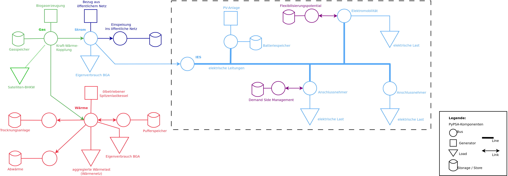
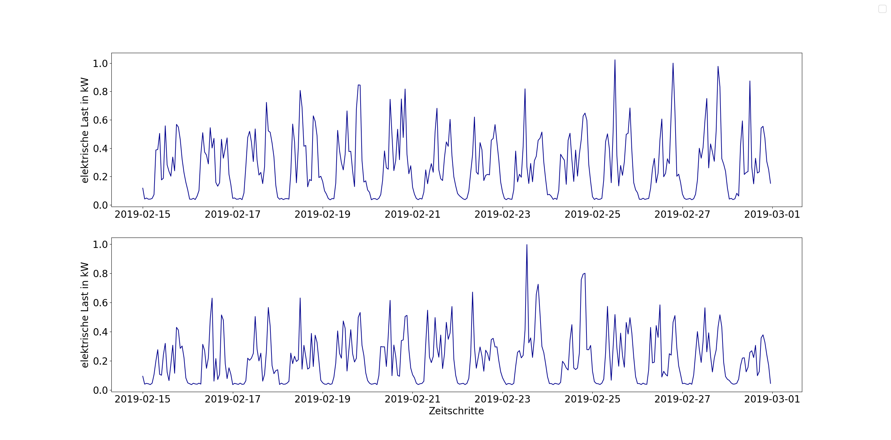
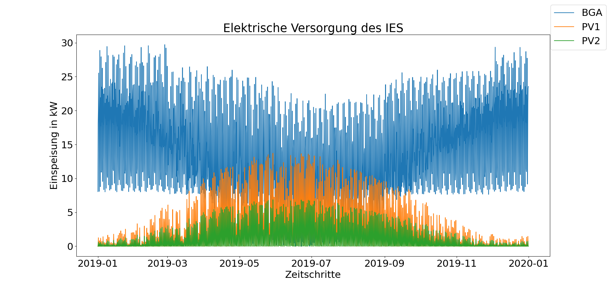

OptIES
======
Das Tool :code:`OptIES` dient der Optimierung regionaler Energiesysteme und wird im Rahmen des Forschungsprojekts "OptIES Dörpum  - Offene Optimierung sektorgekoppelter regionaler Energiesysteme am Beispiel des IES Dörpum" entwickelt. Es basiert auf der offenen Software-Toolbox `PyPSA <https://github.com/PyPSA/PyPSA>`_.

Das Forschungsprojekt `OptIES Dörpum <https://www.uni-flensburg.de/eum/forschung/laufende-projekte/opties-doerpum>`_ wird  durch die `Europa-Universität Flensburg <https://www.uni-flensburg.de/>`_ und die `EcoWert360° GmbH <www.ecowert360.com>`_ bearbeitet und durch das Förderprogramm HWT Energie und Klimaschutz der `Gesellschaft für Energie und Klimaschutz Schleswig-Holstein (EKSH) <https://www.eksh.org/>`_ finanziert. Es stellt die wissenschaftiche Begleitung des Praxisprojekts `IES Dörpum <https://www.aktivregion-nf-nord.de/fileadmin/user_upload/KT_Klimawandel_Energie/Projekte/IES_D%C3%B6rpum/07.51_-_Beschreibung_-_Projekt_57_IES_D%C3%B6rpum.pdf>`_ dar.

Ziel des Forschungsprojekts ist es, lokale sowie nationale Herausforderungen der Energiewende durch Einordung der kommunalen Bestrebungen in das nationale Energiesystem zu beleuchten und analysieren. Das vorliegende Tool dient der Optimierung des regionalen Energiesystems zur Untersuchung und Bewertung von Betriebsstrategien und Entwicklungspfaden des isolierten Systems. Im weiteren Projektverlauf soll das regionale System unter Berücksichtigung des übergelagerten Gesamtsystems optimiert werden, um integrierte Handlungsempfehlungen für die erfolgreiche Energiewende auf kommunaler und nationaler Ebene abzuleiten.

Installation für Entwickler*innen
=================================
Das Tool befindet sich derzeit noch in der Entwicklung.

Es wird die Installation innerhalb einer eigenen virtuellen Umgebung empfohlen:

.. code-block::

  $ virtualenv venv --clear -p python3.8
  
  $ source venv/bin/activate
  
Im Folgenden sind die zu installierenden Pakete gelistet: 
  
.. code-block::
  
  $ pip install --upgrade pip
  
  $ pip install geopandas
  
  $ pip install pypsa==0.21.3
  
  $ pip install Pyomo==6.4.1
  
:code:`gurobipy` stellt das Paket zur Bereitstsellung eines Solvers dar, freie Pakete wie :code:`glpk` sind ebenfalls nutzbar. Als Entwicklungsumgebung kann beispielsweise :code:`spyder` genutzt werden.
  
.. code-block::
  
  $ pip install gurobipy==10.0.1
  
  $ pip install spyder
  
Durch Klonen des Repositories kann das Tool ausgeführt sowie weiterentwickelt werden.

.. code-block::

  $ git clone https://github.com/znes/OptIES.git

Aufbau des Tools
================

Das zentrale Skript dieses Tools bildet :code:`opties.py`, welches der Konfiguration und Ausführung der Berechnungen dient. :code:`data.py` beinhaltet die Funktionen zum Import der notwendigen Eingangsdaten und zum Erstellen eines entsprechenden *PyPSA Networks*. Funktionen innerhalb der Optimierung sowie speziell benötigte Nebenbedingungen sind in :code:`optimization.py` zu finden. :code:`results.py` und :code:`plots.py` halten Funktionalitäten zur Auswertung und grafischen Darstellung der Ergebnisse bereit. 

Neben den beschriebenen Skripten werden Daten für die Durchführung von Optimierungsrechnungen des vorliegenden Systems benötigt. Eine Veröffentlichung geeigneter Inputdatensätze auf `zenodo <https://zenodo.org/>`_ ist in Arbeit. Diese Datensätze werden einerseits reale Messdaten und andererseits synthetisch generierte Daten enthalten. Letztere werden anhand der Messzeitreihen validiert, um sicherzustellen, dass sie möglichst realitätsnah sind. 

Modellkonzept
=============

Die Abbildung des regionalen Energiesystems erfolgt anhand des folgenden Konzepts:

Beispielhafte Inputdaten und Ergebnisse
=======================================

.. class:: center
  Beispiel für Inputdaten: Synthetische elektrische Lastzeitreihen nach [Buettner2022]_

  
.. class:: center  
  Beispiel für Optimierungsergebnis: Elektrische Versorgung des IES Dörpum

Literatur
=========

.. [Buettner2022] C. Büttner, J. Amme, J. Endres, A. Malla, B. Schachler, I. Cußmann, Open modeling of electricity and heat demand curves for all residential buildings in Germany, Energy Informatics 5 (1) (2022) 21. doi:10.1186/s42162-022-00201-y. URL https://doi.org/10.1186/s42162-022-00201-y

Copyleft
========

Code licensed under "GNU Affero General Public License Version 3 (AGPL-3.0)"
It is a collaborative work with several copyright owners:
Cite as "OptIES" © Europa-Universität Flensburg, Centre for
Sustainable Energy Systems
